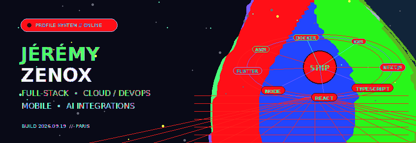
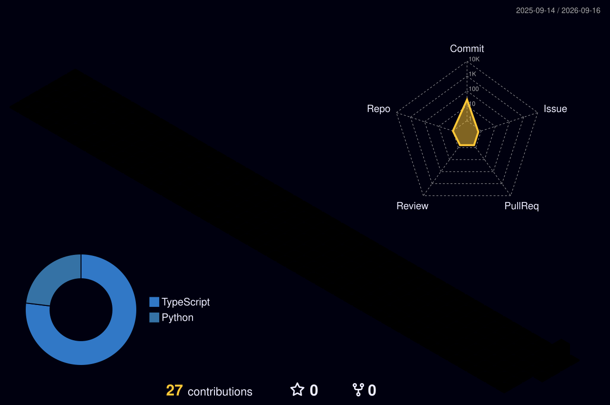

<picture>
  <source media="(prefers-color-scheme: dark)" srcset="./assets/hero.dark.gif">
  <source media="(prefers-color-scheme: light)" srcset="./assets/hero.light.gif">
  
</picture>

<div align="center">

# Jérémy · ZenoX

**Full‑Stack Engineering · Cloud & DevOps · Mobile · AI integrations**

Je conçois et déploie des produits numériques complets : interfaces modernes, back‑ends, applications mobiles, automatisations, intégrations API et infrastructure de production.

<br />

[](https://github.com/jeremyznn)
[](https://github.com/jeremyznn?tab=repositories)
[](https://discord.com/users/461604848924753921)

</div>

<br />

## 01 · What I build

<table>
<tr>
<td width="50%" valign="top">

### Product engineering

Applications web full‑stack, dashboards, SaaS, espaces utilisateurs et interfaces complexes avec une attention particulière portée à l’UX, aux performances et à la maintenabilité.

`React` `Next.js` `TypeScript` `Tailwind CSS` `Radix UI`

</td>
<td width="50%" valign="top">

### Backend & integrations

API REST, authentification, logique métier, paiements, webhooks, services tiers et flux connectés à des bases de données relationnelles ou documentaires.

`Node.js` `Prisma` `MySQL` `MariaDB` `MongoDB` `Stripe`

</td>
</tr>
<tr>
<td width="50%" valign="top">

### Cloud & DevOps

Conteneurisation, orchestration, CI/CD, reverse proxy, déploiement, administration Linux et exploitation d’applications en production.

`Docker` `Kubernetes` `K3s` `AWS · EC2/S3/RDS/Lambda` `Cloudflare` `GitHub Actions`

</td>
<td width="50%" valign="top">

### Mobile & AI

Applications Flutter, notifications et services Firebase, intégration de modèles IA/LLM et automatisation de fonctionnalités produit.

`Flutter` `Firebase` `LLM APIs` `Automation` `Apple / Google Wallet`

</td>
</tr>
</table>

<br />

## 02 · Stack 2026

<div align="center">

### Frontend


### Backend & data


### Mobile · Cloud · Infrastructure


### Integrations & tooling

`Stripe` · `OAuth 2.0` · `Webhooks` · `Firebase` · `Discord.js` · `Apple Wallet` · `Google Wallet` · `Amazon APIs` · `WooCommerce`

<br />


</div>

<br />

## 03 · GitHub live

<picture>
  <source media="(prefers-color-scheme: dark)" srcset="./assets/cards/overview.dark.svg">
  
</picture>

<br />

<picture>
  <source media="(prefers-color-scheme: dark)" srcset="./assets/cards/contributions.dark.svg">
  
</picture>

<br />

<table>
<tr>
<td width="50%">

<picture>
  <source media="(prefers-color-scheme: dark)" srcset="./assets/cards/rhythm.dark.svg">
  
</picture>

</td>
<td width="50%">

<picture>
  <source media="(prefers-color-scheme: dark)" srcset="./assets/cards/languages.dark.svg">
  
</picture>

</td>
</tr>
</table>

<sub>Cartes générées depuis l’API GitHub et commitées automatiquement par GitHub Actions.</sub>

<br /><br />

## 04 · Contribution world · 3D

<p align="center">
  
</p>

<sub>Calendrier de contributions 3D régénéré automatiquement chaque jour.</sub>

<br /><br />

## 05 · Activity stream

<picture>
  <source media="(prefers-color-scheme: dark)" srcset="./assets/contribution-snake-dark.svg">
  
</picture>

<br />

## 06 · Engineering focus

```text
DISCOVER ──► DESIGN ──► BUILD ──► AUTOMATE ──► SHIP ──► OBSERVE ──► ITERATE
   │            │          │           │          │          │           │
 product        UX      full-stack    CI/CD     cloud     monitoring    scale
```

<table>
<tr>
<td width="33%" valign="top">

**Experience**

Interfaces cohérentes, responsive design, composants réutilisables, accessibilité et attention aux détails.

</td>
<td width="33%" valign="top">

**Architecture**

Applications structurées, logique métier claire, API, données et intégrations pensées pour évoluer.

</td>
<td width="33%" valign="top">

**Production**

Conteneurs, orchestration, automatisation, observabilité, sécurité et environnements Linux.

</td>
</tr>
</table>

<br />

---

<div align="center">

### Build clean. Ship reliably. Keep evolving.

**Web · Mobile · Cloud · DevOps · AI**

<sub>Dynamic profile rebuilt by GitHub Actions.</sub>

</div>
