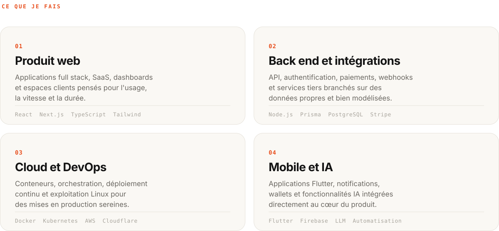
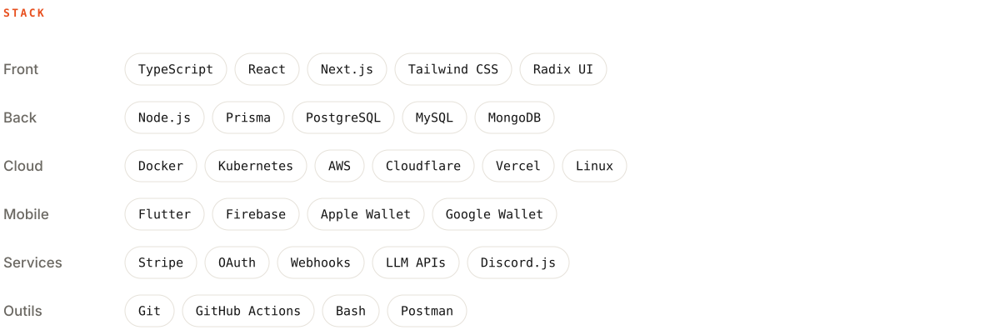
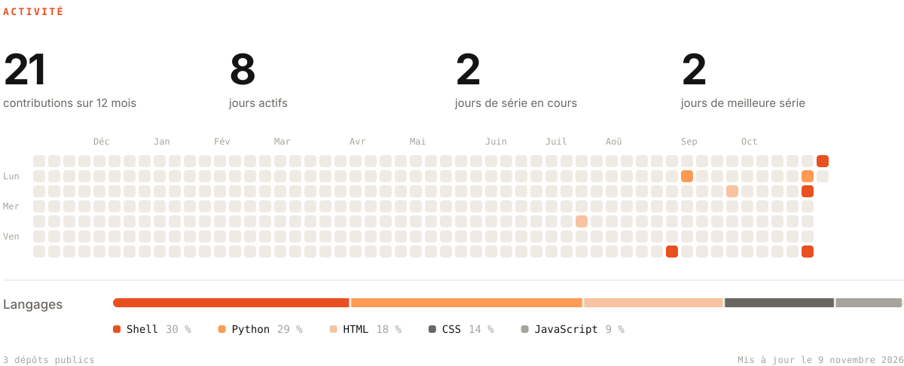

<picture>
  <source media="(prefers-color-scheme: dark)" srcset="./assets/hero.dark.svg">
  
</picture>

 
 

Je conçois et je livre des produits numériques de bout en bout. Interfaces web, back end, applications mobiles, automatisations et infrastructure de production, avec le même soin du premier écran jusqu'au serveur.

**[Portfolio](https://zenoxhq.fr)**&nbsp;&nbsp;&nbsp;&nbsp;**[LinkedIn](https://www.linkedin.com/in/jeremyzn/)**&nbsp;&nbsp;&nbsp;&nbsp;**[Projets](https://github.com/jeremyzn?tab=repositories)**&nbsp;&nbsp;&nbsp;&nbsp;**[Discord](https://discord.com/users/461604848924753921)**

 

<picture>
  <source media="(prefers-color-scheme: dark)" srcset="./assets/services.dark.svg">
  
</picture>

 
 

<picture>
  <source media="(prefers-color-scheme: dark)" srcset="./assets/stack.dark.svg">
  
</picture>

 
 

<picture>
  <source media="(prefers-color-scheme: dark)" srcset="./assets/activity.dark.svg">
  
</picture>
